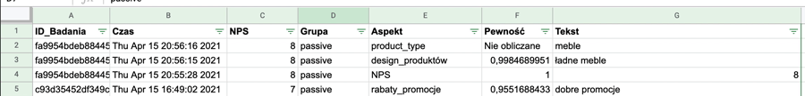

<h1 align="center">💬 NPS bot 💬</h1>

### Chatbot do pomiaru i poprawy NPS 

- Chatbot prowadzi badanie NPS za pośrednictwem dialogu na stronie internetowej, Facebooku, WhatsApp i w innych kanałach.
- Analizuje tekst uzasadnienia odpowiedzi i generuje analizę głównych czynników poprawiających i osłabiających NPS.
- W trakcie interakcji proponuje interwencję (poprawia NPS) poprzez usunięcie problemu zgłoszonego przez klienta.

Przykład działania [chatbota](https://www.qans.pl/services/test-bot/). Przykładowe badanie i demonstracja jak wyniiki są generowane na żywo.   
Wskazówki jak użyć [chatbota](https://www.qans.pl/services/) do identyfikacji czynników wpływających na NPS i do jego poprawy.

Dialog jest analizowany na bieżąco

### Instrukcja instalacji 
Chatbot działa w oparciu o system [Rasa](https://github.com/RasaHQ/rasa).  
Uwaga! Potrzebna jest Rasa wersja 1.0, nie 2.0.  
Dodatkowo pomocna, ale nie niezbędna, jest [Rasa X](https://rasa.com/docs/rasa-x/), system do projektowania dialogów (ang. Conversation-Driven Development (CDD)).  

Kroki:
1. Skopiuj to repozytorium 
    - `git clone https://github.com/QANS-repo/NPS-bot.git`
    -  zainstaluj gspread `pip3 install gspread`
2. Zainstaluj Rasa (i ewentualnie Rasa X)
    - instrukcja dla wersji lokalnej i serwera w sekcji poniżej
3. W folderze z repozytorium z terminala uruchom Rasa i wytrenuj model  
    - Trenowanie modelu `rasa train`
    - Uruchomienie serwera akcji `rasa run actions --debug`
    - Uruchomienie Rasa X `rasa x` lub Rasa w terminalu `rasa shell`

Ten sytem był testowany lokalnie i na serwerze przy użyciu Rasa w wersji 1.10.16 i Rasa X 0.32.2  

### Instalacja na lokalnym komputerze 

Instalacja Rasa Open Source 
[instrukcja](https://rasa.com/docs/rasa/installation/).  
Uwaga! Trzeba podać wcześniejszą wersję, a więc:  
`pip3 install rasa==1.10.16`  

Instrukcja instalacji Rasa X.  
Trzeba podać wcześniejszą wersję jak w przykładzie poniżej:
`python3 -m pip install -U rasa-x --extra-index-url https://pypi.rasa.com/simple/rasa-x/rasa-x-0.32.2.tar.gz`

### Instalacja na serwerze 
[Instrukcja instalacji](https://rasa.com/docs/rasa-x/0.32.x/installation-and-setup/install/docker-compose#manual-installation) przy użyciu Docker Compose 

W przypadku problemów [tu](https://pypi.rasa.com/simple/rasa-x/) można szukać wersji Rasa X.

### Instalacja wymaganych dodatków   
Czatbot NPS to model wytrenowany na systemie Rasa. 
Został on rozszerzony o nastepujące elementy:  
-  Custom Actions specyficzne dla badania NPS
-  Zapisywanie aspektów w Google Sheets (zamiast lokalnej bazie danych). To dla demonstracji 

Pierwszy element wymaga zaimplementowania *actions.py* - serwera akcji. 
Drugi wymaga dodatkowej biblioteki i skonfigurowania Google Sheet. 
Instrukcja instalacji [gspread](https://gspread.readthedocs.io/en/latest/)
Konfiguracja [Google Sheet](https://erikrood.com/Posts/py_gsheets.html)
W folderze actions musisz umieścić plik *credentials.json* wygenerowany w sposób opisany powyżej. 

Jeśli używsz instalacji na serwerze w folderze actions znajduje się plik Dockerfile, który doda bibliotekę gspread do kontenera z serwerem akcji.   

### Problemy z instalacją, używaniem czatbota 
Zaletą wykorzytania systemu Rasa jest to, że jest wiele materiałów dostępnych online. 
Wyszukanie konkretnego błędu lub opisanie problemów doprowadzi Cię na forum lub do innego źródła gdzie znajdziesz rozwiązanie. 

W kontekście NPS i tego systemu pracujemy nad dokładna instrukcją.

### Czy planujemy przejście z wersji Rasa 1.0 na nowszą?
Rasa rozwija się bardzo szybko. Jesienią 2020 gdy powstawł NPS bot to była najnowsza wersja Rasy.  
W wersji Rasa 2.0 zmieniono format trenowania danych. 
Planujemy uaktualnienie do nowszej wersji, ale poczekamy do wersji 3.

### Klient chatbota osadzony na stronie internetowej 
W naszym demo używamy klienta chatbota osadzonego na stronie internetowej. 
Korzystamy z Botfront [Rasa-webchat](https://github.com/botfront/rasa-webchat)

### Jak zmodyfikować kod na potrzeby własnego badania
W dużej mierze to jak trenowanie nowego bota. Potrzeba dialogów, aspektów i przykładowych odpowiedzi od użytkowników.
Bezpłatne [szkolenie na Udemy](https://www.udemy.com/course/rasa-for-beginners/)

Czatbot może być używany w następujących kanałach:
- Facebook Messenger
- Slack
- Google Hangouts
- Webex Teams
- Microsoft Bot Framework
- Rocket.Chat
- Mattermost
- Telegram
- Twilio
- Własny kanał

## Licencja
MIT. Licencja na ten model i kod do badania NPS. Rasa ma odrębną licencję opisaną w ich dokumentacji. 
